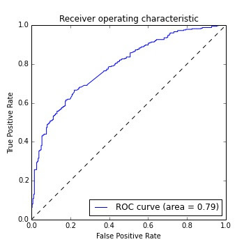

# MUFG_Basic_Camp2024

## 課題
とある架空のローン契約者の信用情報や過去の返済情報などから， 
ローンが完済できない確率を予測するモデルを作成する．

## データセット
### 概要
- 訓練データセット（train.csv）
- テストデータセット（test.csv）
### 説明変数
| ヘッダ名称              | データ型 | 説明                                                                 |
|-----------------------|---------|--------------------------------------------------------------------|
| purpose               | str     | ローンの目的を示すカテゴリ変数                                                   |
| int.rate              | float   | ローンの利率                                                            |
| installment           | float   | 月々のローン返済額                                                         |
| annual.inc            | float   | 年収                                                                |
| dti                   | float   | 借入希望者の負債比率                                                       |
| fico                  | int     | 借入希望者のFICOクレジットスコア                                              |
| days.with.cr.line     | int     | 信用枠の開設期間（日数）                                                    |
| revol.bal             | float   | クレジットカードの未払残高                                                     |
| revol.util            | float   | クレジットカードの利用率（利用可能枠に対する使用済み金額の割合）                               |
| inq.last.6mths        | int     | 過去6ヶ月間のクレジット照会件数（利用可能枠の増額等の際に照会される件数）                               |
| delinq.2yrs           | int     | 過去2年間の延滞回数                                                       |
| pub.rec               | int     | 公的記録（例：破産、税金滞納）の件数                                             |
| not.fully.paid        | int     | ローンが全額返済されなかったかどうか（1=未返済、0=完済）                                   |

### 評価指標
$$\text{AUC} = \int_{0}^{1} \text{TPR}(t) \, d\text{FPR}(t)$$
ここで、
- TPR は True Positive Rate（真陽性率）
$$
\text{TPR} = \frac{\text{TP}}{\text{TP} + \text{FN}}
$$
- FPR は False Positive Rate（偽陽性率）
$$
\text{FPR} = \frac{\text{FP}}{\text{FP} + \text{TN}}
$$

  

## 提出ログ
|日付|精度|モデル|パラメータ|工夫した点|
|:---|:---|:---|:---|:---|
|2024/08/01|0.77751|ランダムフォレスト||欠損値を削除．カテゴリ変数はOneHotエンコーディング（ベースライン）|

## ToDo
- ドメイン知識の取得

## アイデア
- purpose
  - not.fully.paidの割合に応じて3つのラベルに変換
  - all_other を他の変数からさらにカテゴリ分け
- fico
  - ヒストグラムで凸している部分の分析あletら新たな特徴の作成
- inq.last.6mths
  - 積み上げ棒グラフを基にクラスタリング